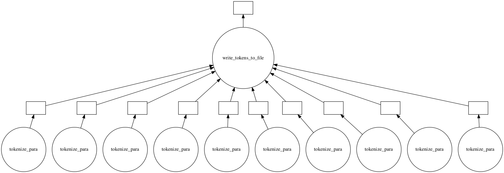
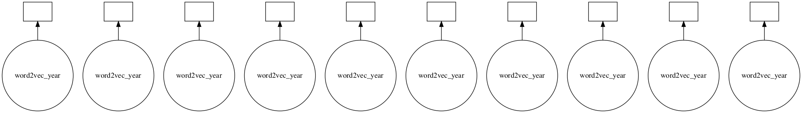
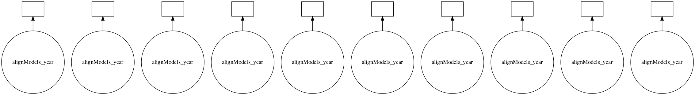
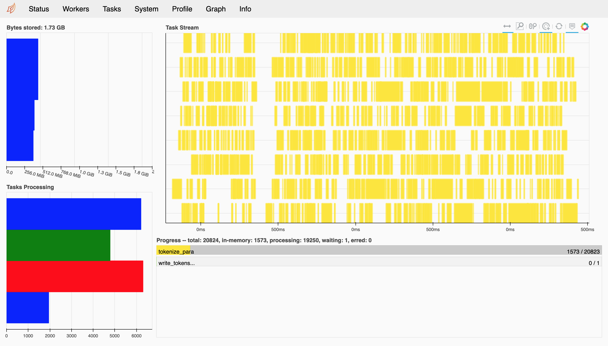

# Final Project

The Dynamics of Political-economic Ideology in China's 40 Years of Reform and Opening-up

## Research design

Text data contains rich information about the historical context in which the text is generated. As social science researchers, we are able to infer latent mechanisms and dynamics underlying the economic and political transformations based on NLP techniques. 

In this project, I examined the dynamics of the political-economic ideology of the Communist Party of China in the past 55 years by identifying the changes in the linguistic meanings of a set of economic words used in the official newspaper. Concretely, I plan to train diachronic word embeddings models based on the ```Word2Vec``` algorithm with the People's Daily corpus. 

### Corpus

The People's Daily is the official newspaper of the Central Committee of the Communist Party of China, which was established in June 1948. For a long period, the People's Daily has been one of the few sources where authoritative statements of government policy and positions are published and documented. The corpus contains a full collection of every daily issue of the People's Daily from 1949 to 2003, which has been built and published for public access based on historical newspaper articles digitalized by the Chinese government. The most recent data is available on [人民日报](www.people.com.cn) but needs web scraping. The raw data file is 2.96GB. 

### ```Word2Vec``` word embedding

Word embedding is a map from document vocabulary to high-dimensional vector representations. It captures rich context information such as pairwise semantic and syntactic similarity of words. Many algorithms perform word embeddings, among which ```Word2Vec```, published by Mikolov et al (2013), is a popular algorithm that is suitable for Latent Semantic Analysis, in which words with similar semantic meanings will occur in similar pieces of text and thus will occupy close spatial positions in the projected semantic space. ```Word2Vec``` learns word embeddings using a shallow neural network and can be obtained by either a Continuous Bag-of-words (CBOW) model or a Skip Gram model. A CBOW model takes the context of each word as the features and predicts the target word, and a Skip-gram, on the contrary, uses the target word to predict the context. In this project, I used the CBOW model, which is faster and has better representations for more frequent words, according to Mikolov et al (2013). With the word vectors representing semantic meanings, the shifts of the meanings of specific political-economic terms can be revealed as the dynamics of the word vectors.

### Procrustes aligning, cosine similarity and Euclidean distance

Since the semantic spaces are given by ```Word2Vec``` models that are trained individually for each year, the word vectors in semantic spaces of different periods are not directly comparable. I ensured the word vectors in different semantic spaces are aligned to the same coordinates following the method by Hamilton et al (2016). Concretely, I used orthogonal Procrustes to align the semantic spaces by solving the following optimization problem: 

$$ 
R^{(t)} 
= \argmin_{\mathbf{Q}^T \mathbf{Q} = \mathbf{I}} 
{||\mathbf{Q} \mathbf{W}^{'(t)} - \mathbf{W}^{'(t+1)}||_F} $$

, where $\mathbf{W}^{(t)} \in \mathcal{R}^{d \times |v|}$ is the matrix of word embeddings for year $t$, with $|v|$ word vectors being of $d$ dimensions each. $\mathbf{W}^{'(t)}$ and $\mathbf{W}^{'(t+1)}$ are submatrices of $\mathbf{W}^{(t)}$ and $\mathbf{W}^{(t+1)}$, which are indexed by the common word set $|v|^{(t)} \cap |v|^{(t+1)}$. The solution can be obtained using an application of Singular Value Decomposition (Schönemann, 1996) and correspond to the optimal rotation to align the two spaces. The consine similarity is reserved in the rotation. 

After aligning the semantic spaces, the dynamics of the vectors of a specific word across years can be measured by cosine similarity or Euclidean distance. 


## Strategy for large-scale computing

### Parallelism

The workflow mainly contains three stages: tokenization and normalization, ```Word2Vec``` training, and orthogonal Procrustes analysis. Each of the three stages was parallelized to reduce runtime. 

The main framework for parallelism was ```Dask```, a Python library for parallel computing. ```Dask``` provides high-level functions that automatically scale up tasks as well as low-level tools for customizing parallel tasks. 

#### Tokenization and normalizaton

First, The full corpus is divided into separated files by years. Second, for each year, articles are cut into sentences and then tokenized using ```jieba```, an NLP toolbox for the Chinese language. The sentences are saved into files for parallelizing the tokenization tasks. For each year, multiple workers keep reading lines from the file of the year and tokenize the sentence. Then each worker will communicate the tokenized words to the master core to save the tokens into a file. The tasks for each year are executed serially, with each task being parallelized. 



#### Word embeddings

In each training process, ```Gensim```’s implementation of ```Word2Vec``` has already been parallelized to employ multi-core CPUs. Finally, to align the semantic spaces across different time slices, we need to perform rotations to align the semantic spaces by solving orthogonal Procrustes problems, which can also be paralleled to reduce runtime. The tasks can run on either the ```midway2``` cluster or on AWS ```EC2``` instances. The workflow is as shown in the graph. 



#### Orthogonal Procrustes Analysis for rotations

For further analysis into dynamics in word vectors through measuring the similarity of two words or the distance of two matrices of word vectors, each year's semantic space is rotated to align to all each other years pairwise. For each year's rotation, its semantic space will be used as the base space, and all other years' corresponding semantic spaces will be rotated accordingly. Concretely, for the year $t$, year $1$'s semantic space is aligned to that of year $t$, and year $2$ will be aligned to the rotated space of year $1$, etc. Therefore, each year can be rotated parallelized and the rotated space will be collected together for further analysis. 

However, aligning the semantic spaces of all the 55 years at one time can be substantially memory-consuming. For each year, all the ```word2vec``` models need to be read into the memory, and $T \times T$ aligned spaces will be generated if there are $T$ years' spaces need to be aligned with each other. This task can cause memory spillover problems even in the ```bigmem``` partition on the midwday2 clusters. Therefore, instead of aligning all the 55 years' semantic spaces at one time, I divide the panel data into three time slices, while ensuring that important historical events are covered in each range. In each time slices, the orthogonal Procrustes analysis is performed pairwise. To reduce memory usage, I further limit the number of spaces to be processed in parallel to 2. That is, for each loop, 2 tasks will be executed in parallel, and other 2-year tasks will be followed serially. 



### Scheduling the parallel tasks

Tasks running with ```Dask``` are represented by graphs, which are composed of nodes and edges. A node is a Python function, between which edges are Python objects that are transferred between functions. Either ```Dask``` built-in collections such as ```Array```, ```Dataframe```, and ```Bag``` or APIs such as ```delayed``` and ```futures``` generate task graphs. The task graphs can be executed on parallel hardware, and there are multiple ways of scheduling the parallel tasks. On a single machine, local threads or processes can be employed by setting ```threads``` and ```processes``` as the scheduler, respectively. 

For dubugging, set up a local cluster to run the tasks on Jupyter notebook: 

```python
from dask.distributed import Client, LocalCluster
cluster = LocalCluster()
client = Client(cluster)
```

To run the Jupyter notebook on the RCC Midway2 cluster: 

```python
from dask.distributed import LocalCluster, Client
client = Client()
```

```Dask``` provides a dashboard with the ```dask.distributed``` schedulers that can be used to visualize the performance of the tasks. 



### Running on clusters

The tasks were executed on RCC Midway2 clusters. ```bigmem``` partition is optimized for running tasks that require big memory allocations. To start a ```bigmem``` computing node on Midway2: 

```bash
$ sinteractive --partition=bigmem2 --ntasks=1 --cpus-per-task=8 --mem=128G --time=12:00:00
```

To load the Anaconda module on the node: 

```bash
$ module Anaconda3/5.3.0
```

To query the IP address and start a jupyter notebook remotely on the computing node: 

```bash
$ /sbin/ip route get 8.8.8.8 | awk '{print $NF;exit}'
10.50.221.198
$ jupyter-notebook --no-browser --ip=10.50.221.198
[I 03:32:26.895 NotebookApp] [nb_conda_kernels] enabled, 7 kernels found
[I 03:32:32.889 NotebookApp] JupyterLab extension loaded from /software/Anaconda3-5.3.0-el7-x86_64/lib/python3.6/site-packages/jupyterlab
[I 03:32:32.889 NotebookApp] JupyterLab application directory is /software/Anaconda3-5.3.0-el7-x86_64/share/jupyter/lab
[I 03:32:36.561 NotebookApp] [nb_conda] enabled
[I 03:32:36.561 NotebookApp] Serving notebooks from local directory: /home/luxintian
[I 03:32:36.561 NotebookApp] The Jupyter Notebook is running at:
[I 03:32:36.561 NotebookApp] http://10.50.221.198:8888/
[I 03:32:36.562 NotebookApp] Use Control-C to stop this server and shut down all kernels (twice to skip confirmation).
```

Note that there will be no internet connection on a computing node on the Midway2 clusters. To install packages dependencies, run the commands on the login node before starting a computing node: 

```bash
$ module Anaconda3/5.3.0
$ pip install ...
```

### Performance evaluation and takeaways

Each of the three stages of this content analysis project ends up with significant speedup with ```Dask``` on the RCC Midway2 cluster in comparison with the serial implementation on a local computer. Although the scale-up of the Procrustes analysis is limited by its consumption of memory, it should not have been possible with the ```bigmem``` partition on Midway2. The runtime of each of the tasks is counted and documented in the notebook. 

Such computational analysis tasks can also be performed on a ```Spark``` framework, which implements many NLP and machine learning algorithms. However, working with ```Dask``` is much easier when external Python libraries are required. Furthermore, like ```PySpark```, ```Dask``` can not only automatically scale-up Python workflows but also easily run on Jupyter notebook, and it also supports GPU jobs, which outperforms lower-level computing frameworks such as MPI or PyOpenCL in terms of flexibility.

## Citations

- Mikolov T, Sutskever I, Chen K, et al. Distributed representations of words and phrases and their compositionality[C]. Advances in neural information processing systems. 2013: 3111-3119.
- Hamilton W L, Leskovec J, Jurafsky D. Diachronic word embeddings reveal statistical laws of semantic change[J]. arXiv preprint arXiv:1605.09096, 2016.
- Schönemann P H. A generalized solution of the orthogonal Procrustes problem[J]. Psychometrika, 1966, 31(1): 1-10.